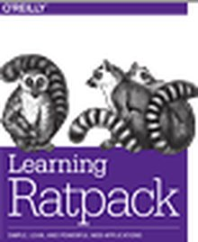

footer: Gr8ConfUS 2016

### Ratpack: Beyond The Web

#### John Engelman
#### @johnrengelman

---

# About Me

* Chief Technologist - Object Partners
* http://www.objectpartners.com
* http://imperceptiblethoughts.com
* github/johnrengelman

---

# Outline

1. Config Management in Ratpack
1. Custom Config Sources
1. Scheduling Tasks in Ratpack
1. Message Driven Ratpack

---

# Configuration Management

---

# Demo

---

# Custom Config Sources

---

# Demo

---

# Scheduled Tasks Execution

---

# Demo

---

# Message Driven Ratpack

---

# Demo

---

# Ratpack: Beyond 1.x

---

# Goal:

## Provide Ratpack Execution Model as standalone library

---

## Example: Use Ratpack Promises in AWS Lambdas

---

# Goal:

## De-centricize Handler-Land from HTTP

---

## Current

```groovy
ratpack {
  handlers {
    get {
      render "Hello World!"
    }
  }
}
```

---

## Pseudo-Future

```groovy
ratpack {
  handlers(Http) {
    get {
      render "Hello World!"
    }
  }
}
```

---

## Allow for non-http handlers

```groovy
ratpack {
  handlers {
    get {
      render "Hello World!"
    }
  }
  handlers(RabbitMq) {
    queue("demo") {
      key("foo") { ctx ->
        ctx.connection.exchange("output").publish(ctx.message.value)
      }
    }
  }
}
```

---

# Resources



slack-signup.ratpack.io

---

# ????
